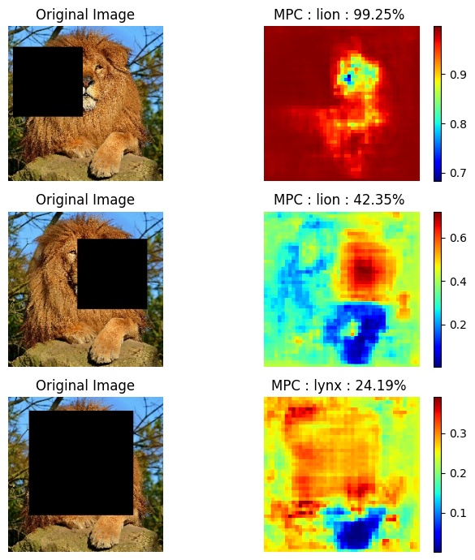

# computer_vision

## Training Basic CNNs from Scratch

The primary goal is to explore various neural network architectures to solve the classification problem on the CIFAR-10 dataset.

- **Initial Attempts with ANN:** We observed very poor performance, indicating that ANNs are not suitable for this type of problem.
- **Model 1(CONV2D + MaxPool) vs. Model 2(CONV2D + CONV2D + MaxPool):** There was a significant improvement in results between these models, although Model 2 still overfitted quickly.
- **Model 3 (Introducing Dropout):** Adding a dropout layer effectively mitigated overfitting and yielded significantly better results.
- **Model 4 (Batch Normalization and Adaptive Learning Rate):** These additions helped accelerate model convergence.
- **Model 5 (Increased Depth and Regularization):** Increasing the network depth allowed the model to capture more details. Additionally, regularizers at each layer further enhanced performance.

  

### Evaluation 
The model 5 (best) is the improvement of all of the other model get  a very good average accuracy of **88%** and average F1-score **88%**

## Training  vs Classification with transfer learning

For the next phase, we aim to achieve better results without transfer learning. We will use InceptionResNetV2 as a pre-trained model because it strikes a balance between complexity and performance. 

$$
\begin{array}{| l | c | r |}
  \hline
  \text{Model Configuration } & \text{Training Time(seconds)} & \text{Test Accuracy} & \text{F1-score} \\
  \hline
  \text{Best Model from scratch (Model 5)} & \text{11 min 31 s} & \text{0.88} & \text{0.88}\\
  \text{New Model (Frozen Convolutional Base)} & \text{02 h 14 min 10 s} & \text{0.93} & \text{0.93}\\
  \text{Fine-tuned Model} & \text{02 h 57 min 49 s} & \text{0.93} & \text{0.93}\\
  \hline
\end{array}
$$

Globally,
- Performance with Transfert learning and Fine Tuning is better than the scratch model
- Training model with transfert learning take more time because the size of the image is increasing so more computation cost

# Input masking

We investigate on  pretrained model are focussing on the image regions containing the most important features map.
This idea has been used by Zeiler and Fergus(2013); see section 4.2 and figure 7d of their paper available here: \href{https://arxiv.org/abs/1311.2901}

One simple approach is to systematically occlude portions of a correctly classified image, and noting how the output probability of the correct class changes. The result is a “saliency map” of the image, that we can visualisefor an indication of what the CNN might be focussing on.
For this task, we choose VGG16.

  

# Social

